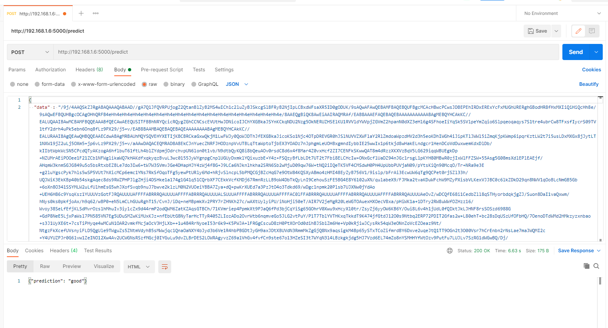

# ML_Final-Project

This guide is for **Windows**. For Linux and MacOS, it should be easier :)

## Installation

1. Install [Anaconda](https://docs.anaconda.com/anaconda/install/windows/)
2. Install [Postman](https://www.postman.com/downloads/)
3. Install [Visual Studio Community](https://visualstudio.microsoft.com/downloads/) (Core Editor Only)
4. Install [CUDA Toolkit 11.0 Update](https://developer.download.nvidia.com/compute/cuda/11.0.3/network_installers/cuda_11.0.3_win10_network.exe)
5. Download [cuDNN 8.0.5 for CUDA 11.0](https://developer.nvidia.com/rdp/cudnn-archive#a-collapse805-110)

   - Extract cuDNN zip file, copy all folders in `cuda` folder to `C:\Program Files\NVIDIA GPU Computing Toolkit\CUDA\v11.0` (select replace)
   - Add these to `Path` environment variables

      ```cmd
      C:\Program Files\NVIDIA GPU Computing Toolkit\CUDA\v11.0\bin
      C:\Program Files\NVIDIA GPU Computing Toolkit\CUDA\v11.0\libnvvp
      C:\Program Files\NVIDIA GPU Computing Toolkit\CUDA\v11.0\extras\CUPTI\lib64
      C:\Program Files\NVIDIA GPU Computing Toolkit\CUDA\v11.0\include
      ```

   - Reboot

6. Create virtual environment
   - `conda create --name tf2.4 python==3.8`
   - `conda activate tf2.4`
   - `pip install tensorflow==2.4.0`
   - `pip install opencv-python`
   - `pip install numpy`

7. Install Jupyter Notebook
   - `conda install -y jupyter`
   - `conda install -y nb_conda`

8. Open the project

    ```sh
    cd ML_Final-Project
    jupyter notebook Final_Project_Bangkit.ipynb
    ```

## Testing

- Convert image to base64 format using [`deploy/tobase64.py`](deploy/tobase64.py) by changing `PATH` variable to your image file location. Then run this command:

   ```sh
   cd deploy
   python tobase64.py
   ```

- Generate JSON
  
  ```sh
  python generateJSON.py
  ```

- run the flask app on `deploy/deploy.py`
  
  ```sh
  python deploy.py
  ```

- Copy everything from `deploy/data.json` to body like this

  

- Test to send POST method to `<url-where-the-flask-app-running>/predict` on Postman

## Deployment

We use **Google Cloud Run** for the deployment of this project

- [`requirements.txt`](deploy/requirements.txt)
- [`cloudmigrate.yaml`](deploy/cloudmigrate.yaml)
- [`Dockerfile`](deploy/Dockerfile)
